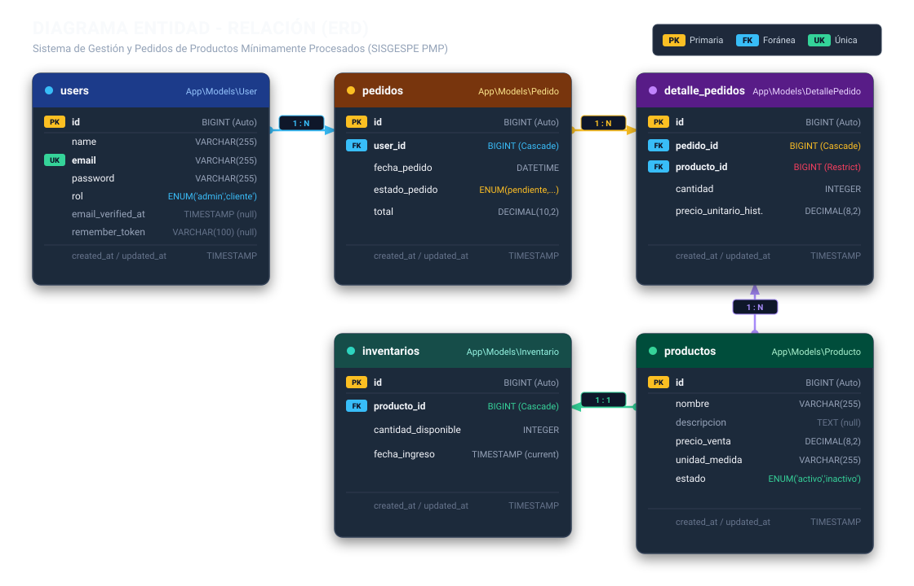
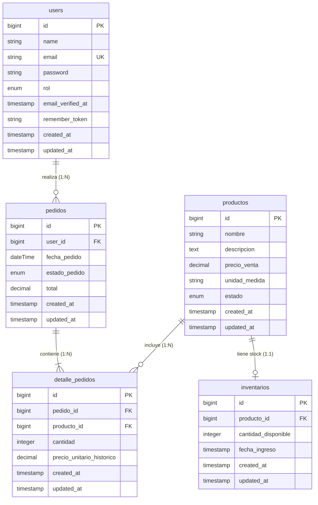

# 🗄️ Documentación de la Base de Datos - SISGESPE PMP

Esta documentación describe la arquitectura de datos, el modelo entidad-relación (ERD), el diccionario de tablas y las relaciones Eloquent correspondientes al backend del **Sistema de Gestión y Pedidos de Productos Mínimamente Procesados (SISGESPE PMP)**.

---

## 📐 Diagrama Entidad-Relación (ERD)

A continuación se muestra el esquema gráfico del modelo relacional con sus entidades, claves y cardinalidades:



---

### Código Fuente del Modelo (Mermaid)



---

## 🔗 Matriz de Relaciones y Cardinalidades

| Entidad Origen | Cardinalidad | Entidad Destino | Clave Foránea (`FK`) | Regla `ON DELETE` | Descripción del Negocio |
| :--- | :---: | :--- | :--- | :--- | :--- |
| **`users`** | `1 : N` | **`pedidos`** | `pedidos.user_id` | `CASCADE` | Un usuario cliente puede generar múltiples pedidos en el tiempo. |
| **`pedidos`** | `1 : N` | **`detalle_pedidos`** | `detalle_pedidos.pedido_id` | `CASCADE` | Cada pedido se desglosa en una o más líneas de productos solicitados. |
| **`productos`** | `1 : 1` | **`inventarios`** | `inventarios.producto_id` | `CASCADE` | Cada producto del catálogo tiene asociado un registro de disponibilidad/stock. |
| **`productos`** | `1 : N` | **`detalle_pedidos`** | `detalle_pedidos.producto_id` | `RESTRICT` | Un producto puede estar en múltiples pedidos. Está protegido contra borrado si tiene compras registradas. |

---

## 🗃️ Diccionario de Datos y Modelos Eloquent

### 1. Tabla `users`
- **Modelo Eloquent:** [`App\Models\User`](../../app/Models/User.php)
- **Propósito:** Gestión de cuentas de usuario con control de roles (`admin` o `cliente`).

| Campo | Tipo de Dato | Nulo | Por Defecto | Descripción |
| :--- | :--- | :--- | :--- | :--- |
| `id` | `BIGINT` (Unsigned) | No | Auto-increment | Identificador único del usuario (Clave Primaria). |
| `name` | `VARCHAR(255)` | No | - | Nombre completo del usuario. |
| `email` | `VARCHAR(255)` | No | - | Correo electrónico único para inicio de sesión. |
| `email_verified_at` | `TIMESTAMP` | Sí | `NULL` | Fecha y hora de verificación de la cuenta. |
| `password` | `VARCHAR(255)` | No | - | Contraseña encriptada con Hash. |
| `rol` | `ENUM('admin', 'cliente')` | No | `'cliente'` | Nivel de autorización dentro de la aplicación. |
| `remember_token` | `VARCHAR(100)` | Sí | `NULL` | Token para persistencia de sesión ("Recordarme"). |
| `created_at` / `updated_at` | `TIMESTAMP` | Sí | `NULL` | Marcas de tiempo de auditoría. |

**Relaciones en el Modelo:**
```php
public function pedidos(): HasMany
{
    return $this->hasMany(Pedido::class, 'user_id');
}
```

---

### 2. Tabla `productos`
- **Modelo Eloquent:** [`App\Models\Producto`](../../app/Models/Producto.php)
- **Propósito:** Catálogo de productos mínimamente procesados (vegetales picados, frutas desinfectadas, pulpas, etc.).

| Campo | Tipo de Dato | Nulo | Por Defecto | Descripción |
| :--- | :--- | :--- | :--- | :--- |
| `id` | `BIGINT` (Unsigned) | No | Auto-increment | Identificador único del producto. |
| `nombre` | `VARCHAR(255)` | No | - | Nombre comercial del producto (Ej: *Chocho*, *Zanahoria en cubos*). |
| `descripcion` | `TEXT` | Sí | `NULL` | Especificaciones de conservación, procesamiento o presentación. |
| `precio_venta` | `DECIMAL(8,2)` | No | - | Precio de venta al público por unidad de medida. |
| `unidad_medida` | `VARCHAR(255)` | No | - | Unidad física de comercialización (*libras*, *Kg*, *bandeja*). |
| `estado` | `ENUM('activo', 'inactivo')` | No | `'activo'` | Control de visibilidad para compras en catálogo. |
| `created_at` / `updated_at` | `TIMESTAMP` | Sí | `NULL` | Marcas de tiempo de auditoría. |

**Relaciones en el Modelo:**
```php
public function inventario(): HasOne
{
    return $this->hasOne(Inventario::class, 'producto_id');
}

public function detallePedidos(): HasMany
{
    return $this->hasMany(DetallePedido::class, 'producto_id');
}
```

---

### 3. Tabla `inventarios`
- **Modelo Eloquent:** [`App\Models\Inventario`](../../app/Models/Inventario.php)
- **Propósito:** Almacenamiento y balance de existencias físicas disponibles para cada producto.

| Campo | Tipo de Dato | Nulo | Por Defecto | Descripción |
| :--- | :--- | :--- | :--- | :--- |
| `id` | `BIGINT` (Unsigned) | No | Auto-increment | Identificador único del registro de inventario. |
| `producto_id` | `BIGINT` (Unsigned) | No | - | Clave foránea que referencia a `productos.id`. |
| `cantidad_disponible` | `INTEGER` | No | `0` | Cantidad de unidades/libras disponibles en almacén. |
| `fecha_ingreso` | `TIMESTAMP` | No | `CURRENT_TIMESTAMP` | Fecha de entrada o actualización del stock. |
| `created_at` / `updated_at` | `TIMESTAMP` | Sí | `NULL` | Marcas de tiempo de auditoría. |

**Relaciones en el Modelo:**
```php
public function producto(): BelongsTo
{
    return $this->belongsTo(Producto::class, 'producto_id');
}
```

---

### 4. Tabla `pedidos`
- **Modelo Eloquent:** [`App\Models\Pedido`](../../app/Models/Pedido.php)
- **Propósito:** Encabezado general de cada orden de compra realizada por los clientes.

| Campo | Tipo de Dato | Nulo | Por Defecto | Descripción |
| :--- | :--- | :--- | :--- | :--- |
| `id` | `BIGINT` (Unsigned) | No | Auto-increment | Número correlativo único del pedido. |
| `user_id` | `BIGINT` (Unsigned) | No | - | Clave foránea que referencia al cliente en `users.id`. |
| `fecha_pedido` | `DATETIME` | No | - | Fecha y hora exacta de emisión del pedido. |
| `estado_pedido` | `ENUM(...)` | No | `'pendiente'` | `pendiente`, `preparando`, `entregado` o `cancelado`. |
| `total` | `DECIMAL(10,2)` | No | `0.00` | Monto acumulado total a pagar por el cliente. |
| `created_at` / `updated_at` | `TIMESTAMP` | Sí | `NULL` | Marcas de tiempo de auditoría. |

**Relaciones en el Modelo:**
```php
public function user(): BelongsTo
{
    return $this->belongsTo(User::class, 'user_id');
}

public function detalles(): HasMany
{
    return $this->hasMany(DetallePedido::class, 'pedido_id');
}
```

---

### 5. Tabla `detalle_pedidos`
- **Modelo Eloquent:** [`App\Models\DetallePedido`](../../app/Models/DetallePedido.php)
- **Propósito:** Detalle ítem por ítem de cada producto solicitado dentro de un pedido.

| Campo | Tipo de Dato | Nulo | Por Defecto | Descripción |
| :--- | :--- | :--- | :--- | :--- |
| `id` | `BIGINT` (Unsigned) | No | Auto-increment | Identificador único de la línea de pedido. |
| `pedido_id` | `BIGINT` (Unsigned) | No | - | Clave foránea referenciando a `pedidos.id`. |
| `producto_id` | `BIGINT` (Unsigned) | No | - | Clave foránea referenciando a `productos.id`. |
| `cantidad` | `INTEGER` | No | - | Cantidad comprada de este producto. |
| `precio_unitario_historico` | `DECIMAL(8,2)` | No | - | Precio congelado al momento de la venta. |
| `created_at` / `updated_at` | `TIMESTAMP` | Sí | `NULL` | Marcas de tiempo de auditoría. |

**Relaciones en el Modelo:**
```php
public function pedido(): BelongsTo
{
    return $this->belongsTo(Pedido::class, 'pedido_id');
}

public function producto(): BelongsTo
{
    return $this->belongsTo(Producto::class, 'producto_id');
}
```

---

## 🛡️ Políticas de Integridad y Reglas de Negocio

1. **Integridad de Ventas (`ON DELETE RESTRICT`):** La relación entre `detalle_pedidos` y `productos` impide la eliminación accidental de un producto si ya tiene historial de compras registrado. De esta forma no se destruyen reportes ni estadísticas contables.
2. **Eliminación en Cascada Controlada (`ON DELETE CASCADE`):**
   - Si se elimina un registro de `pedidos`, se eliminan en cascada sus `detalle_pedidos` asociados.
   - Si se elimina un `producto` (que no tenga ventas previas), se retira automáticamente su registro en `inventarios`.
   - Si se da de baja a un `user`, se limpian sus pedidos asociados.
3. **Inmutabilidad de Precios (`precio_unitario_historico`):** El precio del producto en `detalle_pedidos` se almacena como una instantánea (*snapshot*) del valor al momento de compra. Si el administrador cambia el `precio_venta` en `productos` posteriormente, los pedidos antiguos conservan su valor original.
